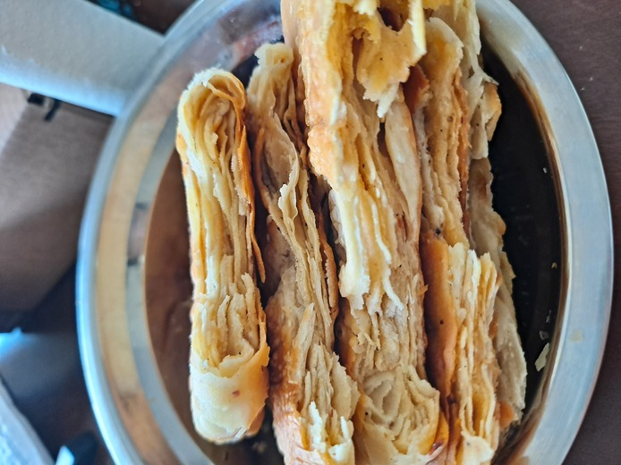

个人食谱 | Personal Recipe
===

我个人坚持烹饪大道至简，追求发挥食材的本味。

I insist in the simplest ways for cooking, and pursue the pure and natural flavor of ingredients.

大道至简的烹饪方式使我容易理解每个配料的用途和给人带来的主观感受。在理解
单一配料的功能用途的基础上，我们就可以理解更加复杂的搭配，甚至可以按照心情
和个人理解进行自由搭配组合。追求本味可以使做出来的食物一直好吃，耐吃。
相对应的，过重的调料或者预调料固然讨人喜欢，可是也经常喧宾夺主，覆盖本味。
对于我个人而言，做饭可能是每天都要重复的事情。追求大道至简和食材的本味
已经可以吃的很开心了。偶尔随心情尝试一些创新的自由创作，感觉会很奇妙。
不管怎么说，花了时间认真做的事情，就要尽可能去享受这个过程。

通用的食谱是一些非常好的模板。我一般不会严格按照模板制作（可能会按照个人口味
和心情调整任何部分）。本章节会提供一些我自己的食谱和照片展示，仅供参考，
不保证符合任何人的口味。

# I. 中国红案 / Chinese Red Board

本章节以主要食材为索引来进行安排。如果多种食材混合容易产生主食材歧义，
则以提供蛋白质的食材为主要索引。

## I.1. 白米饭

主要有三种做法，取决于工具。

(1) 电饭锅：略。
(2) 煮+蒸做法。TODO
(3) 原始煮米法。只要有一口深锅即可。淘米之后放入锅中，加水到沒过指甲。盖上盖子一直小火直到水将近蒸干为止。这种方法会产生副产品锅巴。

## I.2. 鸡蛋系列

### I.2.1. 蛋炒饭

纯粹的炒鸡蛋香加上豆瓣酱酸咸的微妙感觉。
材料：米饭1碗（隔夜或者冷却的最好），鸡蛋2个，豆瓣酱1勺，橄榄油，四川花椒粉（或白胡椒粉）。

步骤：
1. 热锅，确保锅底干燥。
2. 下少许油，晃动锅使油铺满锅底。
3. 油温高或者油温低均可打入鸡蛋，打入后水平晃动锅避免鸡蛋粘连锅底。
4. 鸡蛋底部受热定型后用锅铲搅碎，随意翻动，然后撒入花椒粉（或白胡椒）用于去腥增香，放比两个煎鸡蛋量多一点点盐。
5. 鸡蛋没有肉眼可见流动部分之后倒入米饭，如果米饭已经结块可以在锅里慢慢捣碎，毕竟捣碎的鸡蛋给的时间窗不短。
6. 放半勺豆瓣酱，多了会太咸。也可以不放。翻拌均匀即可出锅。

### I.2.2. 鸡蛋和蔬菜组合

蔬菜=番茄，大葱，小葱，洋葱，胡萝卜，蒜，韭菜，韭菜花，茴香(fennel)，薄荷，青椒

### I.2.3. 白水蛋

### I.2.4. 煎蛋

### I.2.5. 蛋汤

列表中选一：韭菜，西红柿，黄瓜

少量辅料：虾皮，紫菜，香菜

## I.2. 清炖肉

材料：2斤牛肉（beef stew），香料若干。 精髓：食材的本味。

步骤：
1. 牛肉解冻并温水或者冷水浸泡30分钟以上，将血水浸出。沥干水分。牛肉应该是1-3厘米长的肉块。
2. 冷水下锅焯水。冷水应该沒过肉表面，开大火直至水沸腾后再煮5-10分钟。撇去浮沫。
3. 漏勺捞出肉，温水或热水洗净。然后放入温水或热水锅中转小火炖，水至少沒过肉表面，火小到轻微冒泡即可，盖上锅盖。（其实在焯水冷水下锅之后就可以开始烧另一锅水了）
4. 放入适量香料，如生姜片若干，八角三粒，桂皮1片，花椒一把，香叶2片，黄豆若干粒。注意不要放盐，否则会使肉质收紧。
5. 小火炖120分钟以上。至少也要40分钟吧。时间越久肉质越软烂（入口即化）。
6. 选择性放入白萝卜丁，胡萝卜丁，土豆丁等。放入时机取决于想要这些配菜炖到多软。偏硬可以出锅前30分钟放，偏软(甚至化入汤中）可以小火炖的一开始就一起放入。
7. 小火炖的最后15分钟左右放入适量盐，使肉汤有偏淡的底味。
8. 出锅前再放一次盐，将汤味补正。准备小碗，放香菜或者葱花等，将肉汤乘出。

## I.3. 番茄系列

### I.3.1. 番茄吊汤

材料：西红柿，姜

步骤：
1. 姜切末，西红柿切片或者切丁
2. 炒锅热锅下油，油温升高之后将姜末爆香
3. 下西红柿炒，并加入酱油和盐
4. 西红柿出水后锅里加水，酌情加醋

这份汤可以继续放入其他材料，做成比如蛋花汤，或者煮白菜或者排骨。
注意，炒制的部分油放少一些，否则最后的汤可能会很油。

## I.4. 豆腐系列

### I.4.1. 麻婆豆腐

### I.4.2. 白菜豆腐煲

硬豆腐切块，沾鸡蛋煎。煮白菜再下入煎好的豆腐。

## I.5. 鸡系列

清汤鸡

鸡公煲

辣子鸡

口水鸡/白斩鸡

烤鸡

鸡汤 :: 蘑菇炖鸡

## I.6. 鱼系列

水煮鱼

烤鱼

白鱼汤豆腐

## I.7. 水果系列

小吊梨汤

## I.8. 虾系列

白灼虾

## I.9. 羊系列

清炖羊大骨

## I.10. 猪系列

回锅肉。五花。配菜集合：青椒，葱，蒜，

炒肉片。后腿。

鱼香肉丝。里脊。木耳，青笋，胡萝卜，豆瓣酱

## I.11. 牛系列

清炖牛肉

碎牛肉。Ground beef.

## I.21. 豆类

焯水豆芽：油泼面配菜

炒豆芽：韭菜

## I.22. 绿叶类

韭菜汤

## I.23. 西红柿

## I.24. 洋葱

## I.25. 胡萝卜

## I.26. 芹菜

洋葱，胡萝卜，芹菜是西餐老三样。

## I.27. 藕

素炒

# II. 中国白案 / Chinese White Board

白案和核心出发点是和面。和面有问题后续所有流程都会比较难受。
拉面的典型配比：500克面粉，3克盐，1克碱。
发面的典型配料：面粉，酵母，白糖。
饼类的和面一般选择烫面。

## II.1. 面条类

* 拉条子

[1] https://www.bilibili.com/video/BV1rJ411v7uj?share_source=copy_web
[2] https://www.bilibili.com/video/BV1qC4y147Qc?share_source=copy_web
[3] https://www.bilibili.com/video/BV1eL411J7F5?share_source=copy_web

* 扯面 (大宽，二宽)

* 手擀面

* 面片

* 祖传手工面

## II.2. 蒸糕类

* 馒头

* 花卷

* 包子

## II.3. 饼类(煎，烙)

* 杂粮煎饼 (应该是本列表里从毫无准备到可以吃速度最快的面食)

三个关键点，面糊配比，平底不沾锅，平整器。

### II.3.1. 韭菜盒子

### II.3.2. 油酥饼

### III. 欧式, 美式 / European, American

烤牛排
Roasting Steak: https://gist.github.com/cdluminate/1df56a1c9d0b85e52fbe55847a2c549f

苹果派

# IV. 日式, 韩式 / Japanese, Korean

不想做刺身，不过日式料理的熟食想试试。

## IV.1. 汤

* 味增汤。清水煮沸，加入木鱼片（鲣鱼干）制成高汤汤底。干昆布（海带）和嫩豆腐下锅煮熟，并加入味增酱（可以用黄豆酱代替）。撒入葱花完成。

# V. 饮料 / Drinks

## V.1 牛奶

## V.2 豆浆

## V.3 柠檬汁 / Lemonade

Costco有2 lb装，买一袋放冰箱可以解决很长时间的饮料问题。另外需要备一些白沙糖。
一个拳头大的柠檬可以做两杯。洗净（手和柠檬本体）之后横着切成两半
（放射状断面）。准备一个空杯子直接用手捏出柠檬汁，尽量不要把皮捏破不然会有一点苦味。
剩下的果肉可以用勺子挖出来扔进杯子里（不浪费）。加入适量白沙糖。
之后加入温水或者凉水+冰块都可以。半个柠檬一份(杯)的话，水的量依口味在200ml到500ml都行，再多就稀了。
如果酸味过于刺激以至于发涩，可以尝试加微量的盐来中和，注意是微量。勺子搅拌后即完成。

## V.4 其他水果汁

椰子汁

## V.5 复合饮料

杨枝甘露

小吊梨汤

### VI. 甜点 / Sweets

* 戚风蛋糕 | Chiffon Cake

* 焦糖布丁

* 果冻 | Jelly

## 参考资料 | References

* 小高姐的魔法调料，各类教学视频，Bilibili
* 品诺美食开课啦，各类教学视频，Bilibili
